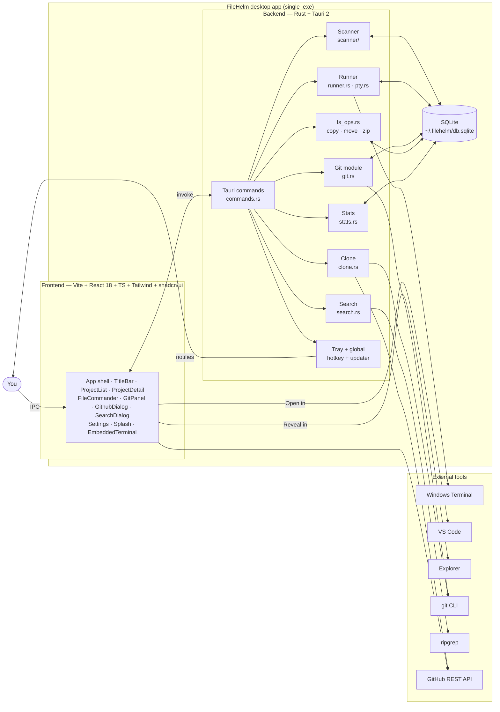
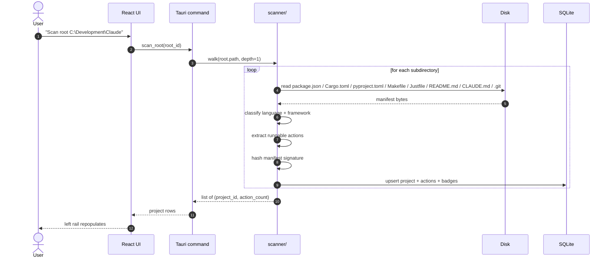
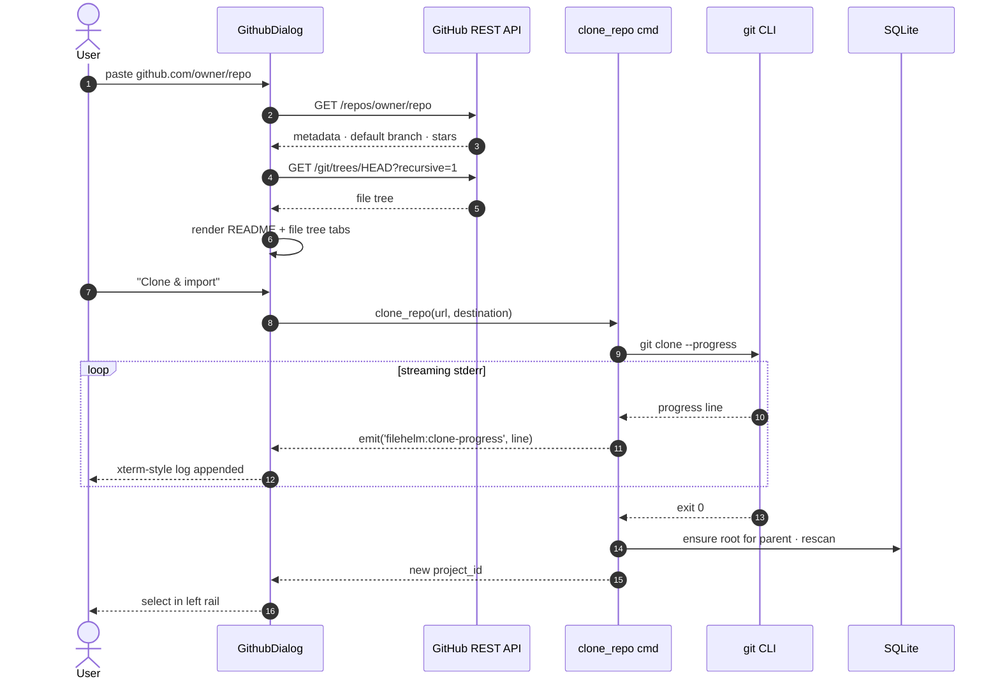
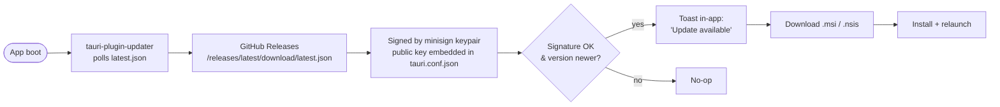

<div align="center">

# ⚓ FileHelm

**The local desktop launcher + file commander for developers who keep
dozens of projects on disk.**

*Auto-detect every project's language and run commands. Launch them
with one click. Browse, copy, zip, and grep across them like it's
1997 — but with eight modern themes and a real GPU-rendered
terminal.*

Built by **Joel Perez** ([@roketteere](https://github.com/roketteere))
&nbsp;·&nbsp; pair-programmed with **Claude (Opus 4.7)**.

[](./LICENSE)
[](https://v2.tauri.app)
[](https://www.rust-lang.org)
[](https://react.dev)
[](https://vitejs.dev)
[](#preconditions)
[](#preconditions)
[](#preconditions)

[Features](#-features-at-a-glance) ·
[Workflows](#-workflows) ·
[Install](#-install) ·
[User guide](./docs/GUIDE.md) ·
[License](#-license) ·
[Commercial use](./COMMERCIAL.md)

</div>

---

## 💸 Free for non-commercial use · Paid for commercial use

FileHelm is **dual-licensed**. If you're a hobbyist, student,
researcher, or charity — it's free. If you (or anyone paying you)
make money from work that uses FileHelm, you need a commercial
license.

- **Non-commercial** → [PolyForm Noncommercial 1.0.0](./LICENSE) —
  no sign-up, no contact, just use it.
- **Commercial** → [`COMMERCIAL.md`](./COMMERCIAL.md) — per-seat /
  team / perpetual / OEM tiers. Email **jxp489@gmail.com** for a
  quote.

The first 30 days at a for-profit entity count as **free
evaluation**. The PolyForm "Violations" clause gives a 32-day cure
window after written notice if you find out you need to pay.

> *Why this license?* We want individual devs and small open
> projects to pay nothing, while companies that build their
> business on FileHelm chip in toward keeping it maintained. The
> source is fully available either way — fork it, patch it, learn
> from it. See [`COMMERCIAL.md`](./COMMERCIAL.md) for the long
> version.

---

## 🚢 What FileHelm is

You probably have a folder like `C:\Development\` full of project
directories. Each one has its own language, its own run command, its
own README. Opening VS Code just to skim a README or remember the
right `pnpm` script is overkill.

FileHelm points at one or more of those folders. It walks each
subdirectory, classifies the project, extracts every runnable
command from manifests + README fenced blocks, and gives you a
**one-click launcher** for the lot — with a **dual-pane file
commander**, **Git surface**, **cross-project ripgrep**, and an
**embedded terminal** wrapped around it.

It's a single `.exe`. Persistent local SQLite. No cloud. No
telemetry. Lives in your system tray until you call it back with
**Ctrl+Alt+Space**.

---

## ✨ Features at a glance

| Surface | What it does |
|---|---|
| **Auto-detection** | 15+ languages (Rust, Node/TS, Python, Go, Java/Kotlin, .NET, Ruby, Dart/Flutter, PHP, Elixir, Deno, Bun, …) and 12+ frameworks (Tauri, Next, Vite, React, Vue, Svelte, Astro, Solid, Angular, Electron, Django, Flask, FastAPI, Streamlit, Flutter, …). |
| **One-click launches** | Every detected `package.json` script, `Cargo.toml` binary, `Makefile` target, `Justfile` recipe, plus shell commands extracted from README/CLAUDE.md fenced blocks. |
| **Embedded terminal** | xterm.js wired to portable-pty / ConPTY. Toggle per-action between external Windows Terminal and an in-app PTY panel. |
| **Action editor + chains** | Override any detected action; compose multi-step chains like `pnpm install ; pnpm dev` that run in one terminal. |
| **Git surface** | Branch chip + dirty / ahead / behind badges on every row; per-project tab with branch switcher, Fetch / Pull, recent commits feed, and an unstaged-vs-staged diff viewer. |
| **Ripgrep search** | Cross-project search (Ctrl+Shift+F) with results grouped by project. |
| **File commander** | Norton-style dual pane (Ctrl+Shift+E): Tab to switch, F2 rename, F3 view, F5 copy, F6 move, F7 mkdir, F8 delete, plus zip/unzip and a full right-click menu. |
| **GitHub explorer** | Paste a repo URL → browse README + file tree (REST API) → clone-and-import with live `git clone --progress` log streaming. |
| **Per-project stats** | File / line / byte counts plus a language breakdown bar chart. Skips `node_modules`, `target`, `.git`, `dist`, `build`. |
| **Themes** | 8 hand-tuned themes (Tokyo Night, Dracula, Catppuccin Mocha, Gruvbox Dark, Nord, Synthwave '84, GitHub Dark, Solarized Light) with per-theme SVG pattern overlays. Brand accent travels with the theme. |
| **Custom keybinds** | Every action rebindable from Settings → Keybinds. Vim-style `j` / `k` / `/` work out of the box. |
| **Right-click menus** | Real context menus on project rows, action cards, commit rows, file-commander entries, GitHub tree nodes, run-history rows — every menu item shadows an existing keybind. |
| **System tray + global hotkey** | Frameless window, custom title bar, close-to-tray, **Ctrl+Alt+Space** toggles the window from anywhere. |
| **CLI companion** | `helm dev <project>` runs the primary action from any terminal — reads `~/.filehelm/db.sqlite` directly, app doesn't need to be running. |
| **Auto-updater** | Tauri-plugin-updater wired against GitHub Releases with a signed `latest.json`. Update prompts inside the app. |
| **Backup / restore** | One-click export / import of `~/.filehelm/db.sqlite` from Settings. |

---

## 🗺️ Architecture



Single-window desktop app. **No HTTP server, no port discovery** —
all IPC goes through `tauri::command`, so there's nothing to clash
with sibling apps. SQLite lives in `~/.filehelm/` so every Claude
session on the same machine sees the same project list.

---

## 🔄 Workflows

### How a project scan works



Each subsequent scan diffs against the manifest signature, so
unchanged projects are a no-op — only the dirty ones get reclassified.

### Clone-and-import from GitHub



### Run an action — external vs embedded

```mermaid
flowchart LR
    Click([Click action card])
    Q{Embedded<br/>terminal toggle?}
    EXT[Spawn Windows Terminal<br/>at project cwd]
    EMB[Spawn ConPTY via portable-pty<br/>stream rows over Tauri events]
    UI[xterm.js panel rises<br/>from the bottom of detail view]
    HIST[Append to run_history<br/>bump last_opened_at]
    KILL[Stop / kill button<br/>tracks PID + cancels event stream]

    Click --> Q
    Q -->|off| EXT --> HIST
    Q -->|on|  EMB --> UI --> HIST
    HIST -.runtime.-> KILL
```

### Auto-update flow



Releases are cut by a GitHub Actions workflow
(`.github/workflows/release.yml`) — see [Releasing](#-releasing).

---

## 📦 Install

### Run the prebuilt installer (recommended)

**Current release: [v0.2.4](https://github.com/roketteere/filehelm/releases/latest)** — first
stable end-to-end release (v0.2.0–v0.2.3 were withdrawn after
bugs surfaced on fresh installs; v0.2.4 rolls up the fixes).

| Platform | Asset(s) |
|---|---|
| **Windows 10/11** | `FileHelm_0.2.4_x64_en-US.msi` (system-wide) or `FileHelm_0.2.4_x64-setup.exe` (NSIS, user) |
| **Linux** | `FileHelm_0.2.4_amd64.deb` (Debian/Ubuntu) · `FileHelm-0.2.4-1.x86_64.rpm` (Fedora/RHEL) · `FileHelm_0.2.4_amd64.AppImage` (portable) |
| **macOS Apple Silicon** | `FileHelm_0.2.4_aarch64.dmg` · `FileHelm_aarch64.app.tar.gz` |
| **macOS Intel** | Pending whenever the macos-13 GitHub Actions runner allocates; the asset publishes to the same release page once the matrix job completes. |

> The in-app auto-updater starts pointing here once the macOS
> Intel job finishes and the canonical `latest.json` lands on the
> release.

If something goes wrong on startup, `~/.filehelm/app.log`
(truncated each launch) and `~/.filehelm/last-panic.log` (rolling
append) capture the exact failure point — useful for filing a bug.

Maintainers cut new releases by pushing a `filehelm-vX.Y.Z` tag —
the `.github/workflows/release.yml` matrix workflow does the rest.

### Run from source

```pwsh
git clone https://github.com/roketteere/filehelm
cd filehelm
pnpm install
pnpm tauri dev          # dev mode: HMR for frontend, cargo watch on Rust
```

Vite dev server binds to **port 5191** (unique per-app so it coexists
with sibling Tauri scaffolds). Rust hot-rebuilds on file change;
React hot-reloads on save.

### Build a release `.exe`

```pwsh
pnpm tauri build
```

Installer + portable `.exe` appear under
`src-tauri/target/release/bundle/`.

### Tests / typecheck

```pwsh
pnpm typecheck                 # TS errors only (no emit)
pnpm build                     # tsc + Vite build
cd src-tauri ; cargo check
cd src-tauri ; cargo test
```

### Regenerate the icon

```pwsh
pnpm gen:icons                 # rasterizes the pink anchor SVG +
                               # fans it out into platform sizes
```

---

## ⌨️ Keyboard shortcuts

Every binding is rebindable from **Settings → Keybinds** (`Ctrl+,`).

| Action | Default |
|---|---|
| Focus search | `Ctrl+K` or `/` |
| Scan all roots | `Ctrl+R` |
| Open Settings | `Ctrl+,` |
| Open Roots dialog | `Ctrl+Shift+R` |
| Open Theme picker | `Ctrl+T` |
| Open Clone from GitHub | `Ctrl+Shift+G` |
| Open cross-project search | `Ctrl+Shift+F` |
| Open file commander | `Ctrl+Shift+E` |
| Toggle window from anywhere | `Ctrl+Alt+Space` *(OS-global)* |
| Next / previous project | `↓` `↑` (or `j` `k`) |
| Run primary action | `Enter` |
| Close dialog / clear search | `Esc` |

### File commander (Norton-style)

| Action | Key |
|---|---|
| Switch active pane | `Tab` |
| Enter folder / open file | `Enter` |
| Up one directory | `Backspace` |
| Rename | `F2` |
| View *(read-only)* | `F3` |
| Edit *(launches VS Code)* | `F4` |
| Copy → other pane | `F5` |
| Move → other pane | `F6` |
| New folder | `F7` |
| Delete | `F8` |
| Multi-select | `Ctrl+Click` / `Shift+Click` |

### GitHub file tree

| Action | Key |
|---|---|
| Move down / up | `↓` / `↑` |
| Expand folder | `→` / `Enter` |
| Collapse folder | `←` |
| Jump top / bottom | `Home` / `End` |

---

## 🪟 Window chrome & tray

FileHelm uses **frameless window chrome** — `decorations: false` with
a custom `TitleBar.tsx`. Same signature pattern as `lobegui` and
`teki-bridge`. Drag anywhere on the bar to move; double-click toggles
maximize.

**The X button hides FileHelm to the system tray.** The app keeps
running so the next click on the tray icon brings it back instantly.
Right-click the tray icon for Show / Hide / Quit.

Toggle off "Close to tray" in Settings → General if you'd rather X
actually quit.

---

## 🗃️ Where data lives

| Path | What |
|---|---|
| `~/.filehelm/db.sqlite` | roots, projects, badges, actions, run history |
| `~/.filehelm/db.sqlite-shm` / `-wal` | SQLite WAL — safe to ignore |
| `localStorage["filehelm.theme"]` | current theme id |
| `localStorage["filehelm.keybinds"]` | rebound shortcuts |
| `localStorage["filehelm.githubToken"]` | GitHub PAT (Clone dialog) |
| `localStorage["filehelm.closeToTray"]` | close-to-tray preference |

To back up FileHelm state, copy `~/.filehelm/` — or hit **Settings →
General → Backup database**. To reset, **Settings → Reset all
settings** wipes localStorage; delete the SQLite file to also forget
your roots and run history.

---

## 🧰 Preconditions

**Supported platforms:** Windows 10/11 · macOS 12+ (Intel + Apple
Silicon) · Linux (Ubuntu/Debian/Fedora/Arch — anything with webkit2gtk).

### Common to all three OSes (only for building from source)

- **Node 20+** and **pnpm** on PATH
- **Rust stable** toolchain (1.78+) via `rustup`
- **`git`** on PATH — only required for Clone-from-GitHub
- **`rg` (ripgrep)** on PATH — only required for cross-project search

### Per-OS notes

**Windows** — Microsoft Edge WebView2 Runtime (Win11 ships with it;
on Win10 install from <https://developer.microsoft.com/microsoft-edge/webview2/>).

**macOS** — No additional dependencies. **The bundle is unsigned at
this stage** so Gatekeeper will throw a "FileHelm can't be opened
because Apple cannot check it for malicious software" warning on
first launch. Two ways past it:

```bash
# Easiest: right-click FileHelm.app in /Applications, choose Open,
# confirm the dialog. macOS remembers your choice for next time.

# Or, from Terminal:
xattr -d com.apple.quarantine /Applications/FileHelm.app
```

Subsequent launches are friction-free. We may add Developer ID
notarization in a future release.

**Linux** — desktop deps (Ubuntu / Debian names; the
equivalents on Fedora / Arch are similar):

```bash
sudo apt-get install \
  libwebkit2gtk-4.1-0 \
  libayatana-appindicator3-1 \
  librsvg2-2
```

For building from source you also need the `-dev` variants:
`libwebkit2gtk-4.1-dev`, `libayatana-appindicator3-dev`,
`librsvg2-dev`, `libgtk-3-dev`, `patchelf`.

---

## 🛠️ Stack

| Layer | What we use |
|---|---|
| Desktop shell | **Tauri 2** with the `tray-icon` feature, `tauri-plugin-dialog/fs/opener/shell/global-shortcut/updater` |
| Backend language | **Rust 1.78+** edition 2021 |
| DB | **SQLite** via **sqlx 0.8** (runtime queries, no compile-time `DATABASE_URL`) |
| PTY | **portable-pty 0.8** (ConPTY on Windows) |
| Filesystem walk | **walkdir 2** |
| Zip / unzip | **zip 2** (deflate) with zip-slip guard |
| Frontend bundler | **Vite 5** |
| Frontend framework | **React 18** + **TypeScript 5** |
| Styling | **Tailwind CSS 3** + custom CSS-vars-per-theme |
| Primitives | **shadcn/ui** wrapping **@radix-ui/react-*** |
| Markdown | **react-markdown** + **rehype-raw** + **rehype-highlight** |
| Icons | **lucide-react** + **simple-icons** (language brand colors) |
| Terminal | **xterm.js** + **xterm-addon-fit** |

---

## 🚀 Releasing

Releases are cut by `.github/workflows/release.yml` on git tag push.

```pwsh
# bump src-tauri/tauri.conf.json version + package.json version + Cargo.toml version
git tag v0.x.y
git push --tags
```

The workflow:

1. Builds the Windows installer (`tauri-apps/tauri-action@v0`).
2. Signs the bundle with the minisign keypair stored in GitHub
   Secrets `TAURI_SIGNING_PRIVATE_KEY` + `TAURI_SIGNING_PRIVATE_KEY_PASSWORD`.
3. Publishes `latest.json` next to the `.msi` / `.nsis` so the
   in-app updater can find it.
4. Creates a GitHub Release with the assets attached.

The minisign **public** key is embedded in `tauri.conf.json` under
`plugins.updater.pubkey`. The **private** key lives in
`.secrets/filehelm-updater.key` locally (gitignored) and as a
GitHub Secret. Don't ever push the private key.

---

## 🧭 Phasing

| Phase | Scope | Status |
|---|---|---|
| 1   | MVP launcher: scan, classify, run-in-external-terminal | shipped |
| 1.5 | Hierarchy + breadcrumbs UX | shipped |
| 1.6 | 8 themes + texture/pattern overlays | shipped |
| 1.6.5 | Markdown raw-HTML rendering | shipped |
| 1.7 | GitHub explorer + clone-and-import | shipped |
| 1.8 | Frameless chrome + pink brand + system tray | shipped |
| 1.9 | Custom keybinds + tree navigation + Settings + in-app Guide | shipped |
| 2.0 | Git surface: status badges + commits + pull/fetch | shipped |
| 2.1 | QoL: sort modes + pin + drag-drop folder + close-to-tray toggle + run history | shipped |
| 2.2 | `helm` CLI companion (`cli/`) | shipped |
| 2.3 | CHANGELOG viewer, open-in-browser, custom icon, stats, backup/restore, action editor + chains | shipped |
| 2.4 | Splash, drag-reorder pinned, live clone progress, branch switcher, diff viewer, ripgrep search | shipped |
| 2.5 | Embedded PTY runner (xterm.js + portable-pty / ConPTY) | shipped |
| 2.6 | OS-global hotkey + Tauri auto-updater scaffold | shipped |
| 3   | Norton-style dual-pane file commander (MVP) | shipped |
| 3.1 | Commander upgrades: toolbar + zip/unzip + multi-select + Commander header button | shipped |
| 3.2 | Right-click context menus across the app | shipped |

See [`docs/GUIDE.md`](./docs/GUIDE.md) for the deep user guide and
[`CHANGELOG.md`](./CHANGELOG.md) for release-by-release changes.

---

## 🧪 CLI companion (`helm`)

A standalone `helm` CLI ships under `cli/`. Reads
`~/.filehelm/db.sqlite` directly via better-sqlite3 — the desktop
app doesn't have to be running.

```pwsh
cd cli
pnpm install
pnpm link --global
```

Then from any terminal:

```pwsh
helm list                  # all projects + languages
helm list -v               # plus every detected action
helm dev filehelm          # fuzzy project lookup → run primary dev action
helm run scumdump build    # run a specific action by label fragment
helm roots                 # registered roots
```

Launches via `helm` bump `last_opened_at` + log to `run_history` so
they show up in the desktop app's History tab.

---

## 🆚 Why FileHelm vs the alternatives

| You currently use… | FileHelm gives you… |
|---|---|
| **VS Code "Recent" list** | Auto-classification (15+ languages, 12+ frameworks), one-click action launches that bypass VS Code entirely, file commander for ops you'd do outside the editor. |
| **A folder of bookmarks / `.lnk` files** | A live database that rescans manifests — no stale shortcuts when you rename a project. |
| **A pile of terminal aliases** | Discoverable. Every script in `package.json` and recipe in your `Justfile` becomes a button without you remembering it. |
| **Total Commander / Far Manager** | Same dual-pane workflow + the Git surface + cross-project rg + a launcher that knows what each project is. |
| **GitHub Desktop** | Same per-project git status + branch switcher + diff, plus the *other 90% of your day* (running actions, exploring files, jumping between repos). |
| **Ad-hoc PowerShell scripts** | All your repetitive run / clone / archive flows behind keybinds. Action editor when the heuristic misses. |

---

## 🐛 Troubleshooting

<details>
<summary><b>Port 5191 already in use</b></summary>

Another dev server collided. Find it with:

```pwsh
netstat -ano | findstr ":5191"
```

Either quit the colliding process or change the port in
`vite.config.ts` and `src-tauri/tauri.conf.json` (devUrl).
</details>

<details>
<summary><b>Left-click on the tray icon does nothing</b></summary>

Some Windows shells drop single-click events. Double-click works as
a fallback. For diagnosis:

```pwsh
$env:RUST_LOG = "info,filehelm=debug"
pnpm tauri dev
```

Every tray event prints to the console.
</details>

<details>
<summary><b><code>git clone</code> fails inside the GitHub dialog</b></summary>

`git` isn't on PATH. Install from <https://git-scm.com> and restart
FileHelm. If git is installed but clone still fails, the captured
stderr log appears in the dialog — usually a network / auth /
"destination already exists" error.
</details>

<details>
<summary><b>Frameless window can't be moved / minimized</b></summary>

Window permissions are missing from
`src-tauri/capabilities/default.json`. `core:default` alone is
**not** enough — you must explicitly grant
`core:window:allow-start-dragging`, `allow-minimize`,
`allow-maximize`, `allow-unmaximize`, `allow-toggle-maximize`,
`allow-close`, `allow-hide`, `allow-show`, `allow-set-focus`,
`allow-unminimize`, `allow-is-maximized`, `allow-is-visible`.

Without these, the drag region silently no-ops and the buttons
throw "permission denied" errors that don't surface in the UI.
</details>

<details>
<summary><b>A project's actions are missing or wrong</b></summary>

Click **Rescan** in the project detail header. If the heuristic
still gets a README fenced-block command wrong, open **Edit actions**
on that project — the override is persisted with `is_user_override
= 1` and survives subsequent rescans.
</details>

<details>
<summary><b>The embedded terminal doesn't render correctly</b></summary>

Check that the xterm font ligatures aren't fighting your theme.
The PTY itself uses ConPTY on Windows — anything visible in
`cmd.exe` should be visible here.
</details>

---

## 🤝 Contributing

PRs welcome. By submitting a PR you agree to license your
contribution under both PolyForm Noncommercial 1.0.0 *and* the
commercial-license terms in [`COMMERCIAL.md`](./COMMERCIAL.md) so
we can keep selling commercial licenses without per-customer
consent forms.

For non-trivial changes, please open an issue first to align on
direction.

---

## 📜 License

FileHelm is **dual-licensed**:

- [PolyForm Noncommercial 1.0.0](./LICENSE) — free for personal,
  hobby, academic, research, and non-commercial use.
- [Commercial license](./COMMERCIAL.md) — required for use by any
  for-profit company, contractor, or paid project. Email
  **jxp489@gmail.com** for a quote.

> Required Notice: Copyright 2026 Joel Perez (@roketteere) & Claude
> (Opus 4.7). FileHelm — dual-licensed (PolyForm Noncommercial
> 1.0.0 + Commercial). See COMMERCIAL.md.

---

## 👥 Authors

| Who | Role |
|---|---|
| **Joel Perez** ([@roketteere](https://github.com/roketteere)) | Product, UX, design calls, every "ship it" decision |
| **Claude (Opus 4.7)** — Anthropic | Pair programmer, backend + frontend code, docs co-author |

Every commit in this repo is one of us. Co-authorship is captured
in the commit trailers; the README + guide byline both names
because that's how it was actually built.

<div align="center">

*If FileHelm makes your dev flow faster — and you make money with
it — get a [commercial license](./COMMERCIAL.md). It keeps the
project maintained, and it lets the people who use it for free
keep using it for free.*

⚓

</div>
